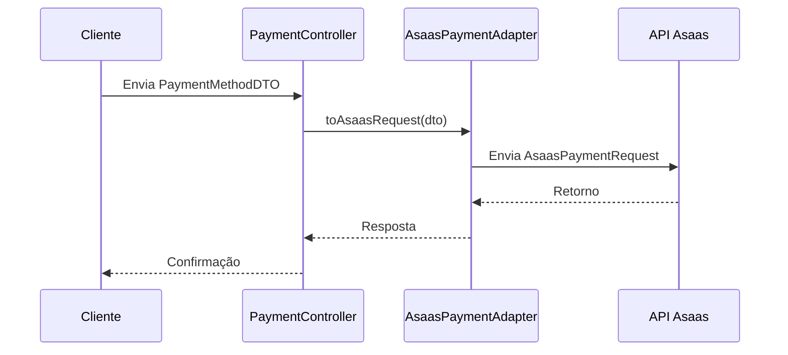

## Integração Asaas

### Fluxo Principal

### Dependências
| Classe               | Tipo        | Descrição                             |
|----------------------|-------------|---------------------------------------|
| `PaymentMethodDTO`   | Consumo     | Entrada do core application           |
| `AsaasPaymentRequest`| Produção    | Saída para API externa                |
| `AsaasPaymentClient` | Colaboração | Cliente HTTP para envio               |

### Especificações Técnicas
- **Padrão**: Adapter Pattern
- **Thread Safety**: Stateless (thread-safe)
- **Cache**: Não recomendado (dados sensíveis)